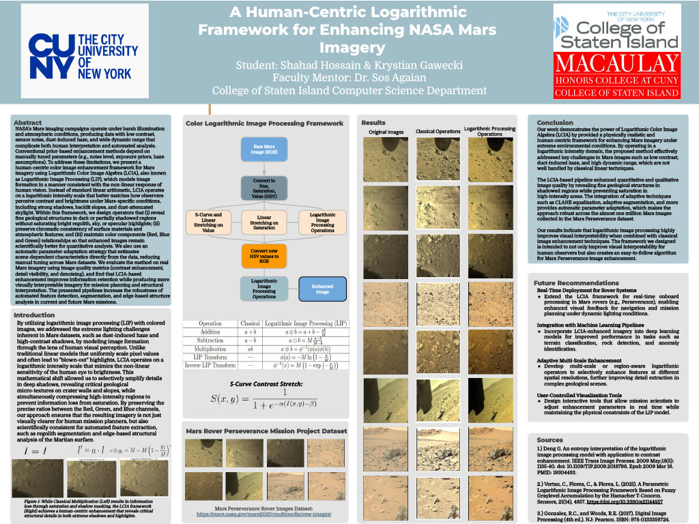

# A Human-Centric Logarithmic Framework for Enhancing NASA Mars Imagery

**Authors:** Shahad Hossain & Krystian Gawecki
**Faculty Mentor:** Dr. Sos Agaian
**Institution:** College of Staten Island Computer Science Department, Macaulay Honors College at CUNY
**Timeline:** Spring 2026  

---

## Research Poster

*Click [here](Shahad%20%26%20Krystian%20Project%20Poster%20.pdf) to download the full PDF version of the poster.*

## Project Overview
NASA's Mars imaging campaigns operate under harsh illumination and atmospheric conditions, producing data with low contrast, sensor noise, dust-induced haze, and wide dynamic range. These factors complicate both human interpretation and automated analysis. 

To address these limitations, we developed a human-centric color image enhancement framework utilizing Logarithmic Color Image Algebra (LCIA), also known as Logarithmic Image Processing (LIP). This mathematical shift models image formation in a manner consistent with the non-linear response of human vision, allowing us to selectively amplify details in deep shadows without causing "blown-out" highlights in bright regolith or sky.

### Key Achievements
* **Revealed Geological Structures:** Uncovered fine micro-textures on crater walls and partially shadowed regions.
* **Chromatic Consistency:** Preserved the precise relationships between Red, Green, and Blue channels, ensuring the imagery remains scientifically viable for quantitative analysis and automated feature extraction.
* **Automatic Parameter-Adaptation:** Developed a strategy that estimates scene-dependent characteristics directly from the data, reducing the need for manual tuning across the nearly one million images in the Mars Perseverance dataset.

## Math

Unlike classical linear models that uniformly scale pixel values (e.g., $I^{\prime}=\alpha\cdot I$), the LCIA framework operates on a logarithmic intensity domain. Key operations include:

* **LIP Addition:** $a \oplus b = a + b - \frac{ab}{M}$
* **LIP Subtraction:** $a \ominus b = M\frac{a-b}{M-b}$
* **LIP Transform:** $\phi(a) = -M \ln(1-\frac{a}{M})$
* **S-Curve Contrast Stretch:** $S(x,y) = \frac{1}{1+e^{-\alpha(I(x,y)-\beta)}}$

### Processing Pipeline
1. Ingest raw Mars Perseverance Rover imagery.
2. Convert color space to Hue, Saturation, Value (HSV).
3. Apply S-Curve and Linear Stretching on the Value channel.
4. Apply Linear Stretching on the Saturation channel.
5. Execute Logarithmic Image Processing operations.
6. Convert the newly processed HSV values back to RGB.

## Future Recommendations
* **Real-Time Deployment:** Extend the LCIA framework for real-time onboard processing in Mars rovers to enable enhanced visual feedback for navigation.
* **Machine Learning Integration:** Incorporate enhanced imagery into deep learning models to improve terrain classification, rock detection, and anomaly identification.
* **Adaptive Multi-Scale Enhancement:** Develop region-aware logarithmic operators to selectively enhance features at different spatial resolutions.
* **User-Controlled Tools:** Design interactive tools allowing mission scientists to adjust parameters in real-time while maintaining the physical constraints of the LIP model.

## References
1. Deng G. An entropy interpretation of the logarithmic image processing model with application to contrast enhancement. *IEEE Trans Image Process*. 2009.
2. Vertan, C., Florea, C., & Florea, L. A Parametric Logarithmic Image Processing Framework Based on Fuzzy Graylevel Accumulation. *Sensors*, 2021.
3. Gonzalez, R.C., and Woods, R.E. *Digital Image Processing (4th ed.)*. Pearson, 2017.
